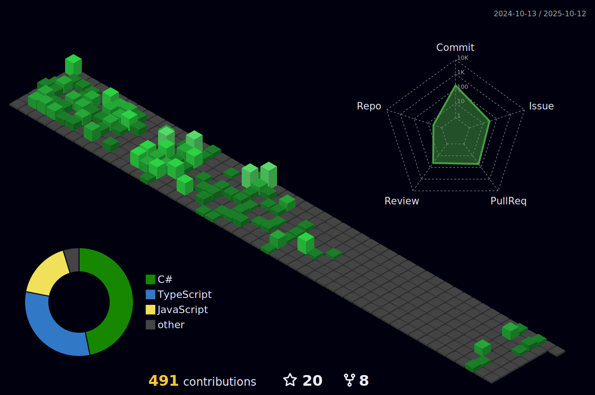

👋 Simon Sörqvist 
👀 Interested in Software Development and IT in general 
🌱 I’m currently doing the second part of my internship at Precio Fishbone Gothenburg 

#

### 🏗️ Skillset 

  
  
  
  
  
  
  
  
  
  
  
  
  
  
  
  
  
  
  
  
  
  
  
  
  
  
  
      
  
  
  

#

### 📊 Statistics

  
  

